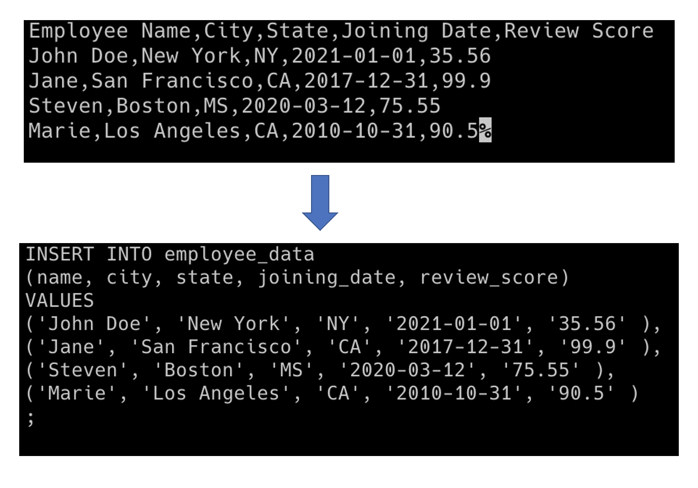
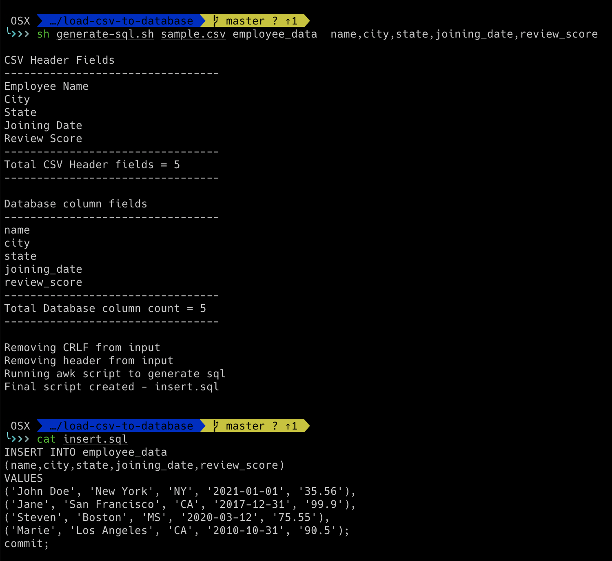
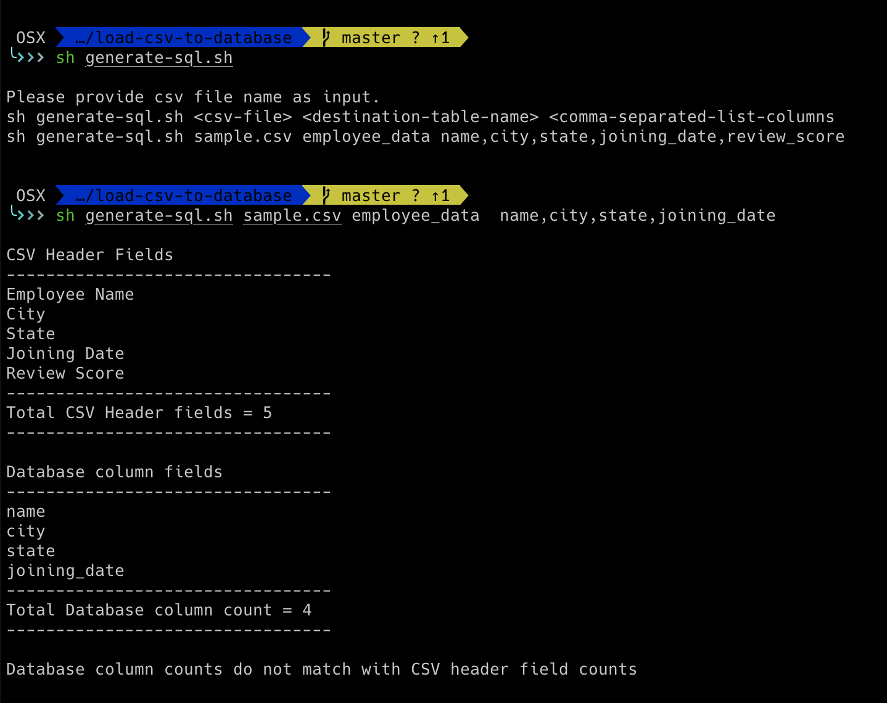

## Converting a sample csv to sql insert statements

This script is used for converting CSV file to a SQL Insert statement, that can be used to load the csv data into a database




### Sample Data for Testing
 - Create table script to create the sample table for testing
    - [MySQL](create-table-mysql.sql)
    - [PostgreSQL](create-table-postgres.sql).
 - [Sample CSV file](sample.csv)
   

### Running the script
 - Input required
    - CSV Input file. e.g `sample.csv`
    - Destination Database table name. e.g `employee_data`
    - Table column list (comma separated without space). e.g.`name,city,state,joining_date,review_score`
   <br/><br/>
      
   Run using command
   ```
   sh generate-sql.sh <input-file> <table-name> <comma-separated-table-columns-list>
   ```
   e.g.
   ```
   sh generate-sql.sh sample.csv employee_data  name,city,state,joining_date,review_score
   ```
  
### Limitations and Future Optimizations

The script as of now has following limitations
 - Has been only tested for following data types - String, date, decimals, etc.
 - Dates in CSV needs to be in `YYYY-MM-DD` format
 - Does not supports Null values

### Sample Screenshots


<br/>
<br/>


